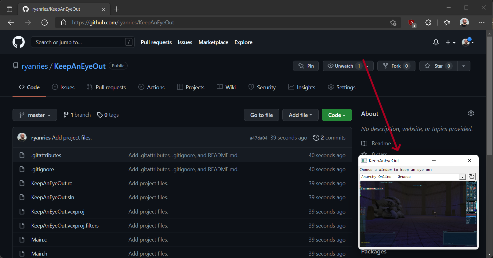

KeepAnEyeOut

Joseph Ryan Ries - 2022

https://github.com/ryanries/KeepAnEyeOut

This app lets you keep an eye on another app in the background while you are multitasking.
I originally created this app so I could keep an eye on my MMORPG while I was camping a mob.
This way I could see when the mob had respawned even if I was browsing the web or working on something else.
Important: Per-monitor DPI awareness should be set in the application manifest.

